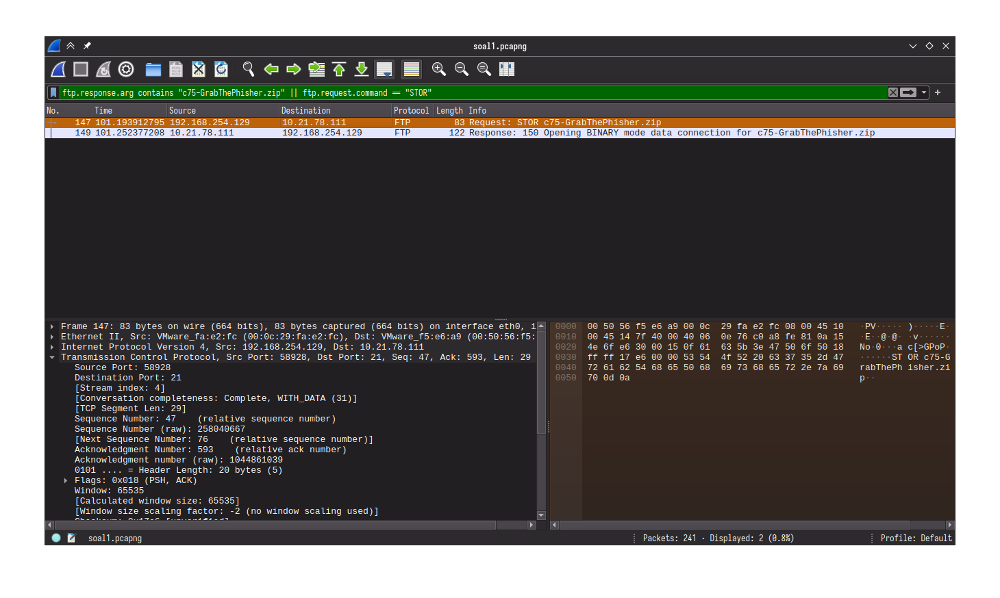
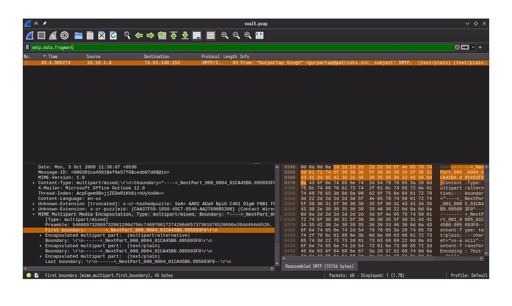
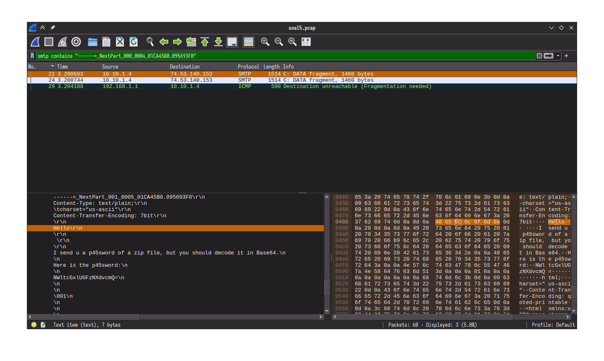
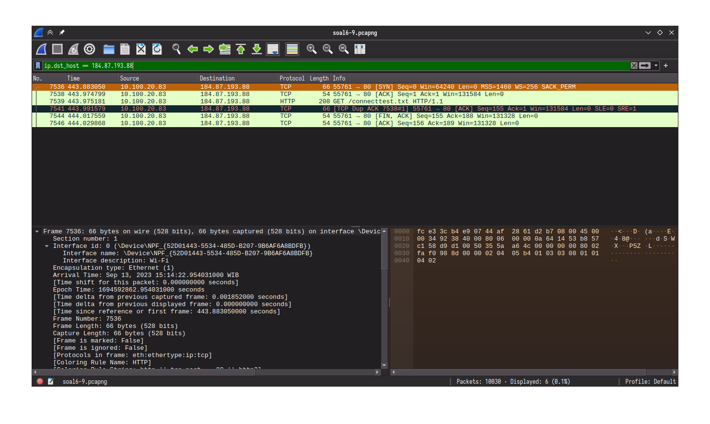

# Laporan Resmi Modul 1 Jarkom 2023

Kelompok **B15**

Anggota:

- [MH] Muhammad Hidayat (05111940000131)
- [VG] Victor Gustinova (5025211159)

## Soal 1 [MH]

Filter yang digunakan pertama adalah `ftp.request.command == "STOR"` untuk perintah upload dan ditemukan frame 147.

<!-- TODO change wikilink format -->


Didapatkan nilai berikut:
- sequence number (raw): 258040667
- acknowledgement number (raw): 1044861039

Diketahui nama filenya adalah `"c75-GrabThePhisher.zip"`, jadi dicari dengan filter
`ftp.response.arg contains "c75-GrabThePhisher.zip"` dan ditemukan pada frame 149.


Didapatkan nilai berikut:
- sequence number (raw): 1044861039
- acknowledgement number (raw): 258040696

Berikut kedua frame yang dimaksud:



Dari sana dapat didapatkan flagnya.


## Soal 2 [VG]
### Sebutkan web server yang digunakan pada portal praktikum Jaringan Komputer!
Nama web server dapat dilihat pada bagian Hypertext Transfer Protocol pada paket yang berasal dari ip 10.21.78.111 (portal praktikum).
Mencari packet dapat menggunakan display filter berikut.
```
ip.src == 10.21.78.111
```


Didapatkan web server **gunicorn**

## Soal 3 [MH]

Awalnya kami mencari IP 239.255.255.250. Kami menemukan bahwa UDP dan SSDP (melalui protokol UDP) memberikan informasi port. Ini yang mendasari jawaban kami untuk (b).

Kalimat display filter yang digunakan:

`ip.host == 239.255.255.250 && udp.port == 3702`

Untuk (a), banyak paket yang tampil dengan filter di atas terdapat 21. Ini didapat dari pojok kanan bawah tampilan Wireshark.


## Soal 4 [VG]
### Berapa nilai checksum yang didapat dari header pada paket nomor 130?

Nilai checksum bisa dilihat langsung jika mengklik paket nomor tersebut. Akan tetapi, mungkin saja terlihat seperti berikut.


Agar checksum bisa divalidasi maka dapat diklik kanan, pilih protocol preferences, dan pilih validate checksum if possible.


Setelah itu akan terlihat nilai checksum yang benar.


Didapatkan nilai checksum **0x3656**

## Soal 5 [MH]

Awalnya sempat ada kendala karena kesalahan pada file `soal5.pcapng`. Setelah adanya koreksi dengan `soal5.pcap`, soal dapat dikerjakan.

a. Banyak packet yang ditangkap adalah 60.

   

b. Port SMTP adalah port 25.

c. Hanya ada satu public IP, yaitu 74.53.140.153

Pertama, dicari adanya data fragment dalam email menggunakan display filter `smtp.data.fragment`. Ditemukan satu frame (no. 45) yang mengandung beberapa boundary.



Boundary pertama adalah
```
------=_NextPart_000_0004_01CA45B0.095693F0
```

maka dicari frame pertama yang memenuhi. Filter yang digunakan adalah sebagai berikut dan ditemukan pada frame 22.

```
smtp contains "------=_NextPart_000_0004_01CA45B0.095693F0"
```

Ditemukan isi email yang bersi password pada frame tersebut:

```
Hello

I send u a p45sword of a zip file, but you should decode it in Base64.

Here is the p45sword:

NWltcGxlUGFzNXdvcmQ=
```



> RALAT: Sebenarnya keseluruhan konten email dapat dilihat dari frame 45 tersebut. Frame 22 hanya mengandung sebagian saja (_fragment_). Kebetulan frame inilah yang mengandung bagian yang terdpat password untuk file zip.

Kemudian password di-decode menggunakan `base64` yang terpasang di sistem Linux saya. Password ini digunakan untuk membuka file `zipppfileee.zip`. Isi dari zip tersebut adalah sebuah file teks berisikan perintah untuk menyambungkan ke instance tertentu untuk menjawab pertanyaan dan mendapatkan flag.


> Kowalski, analysis.

(also love the penguins reference)

Fun fact: sisa dari isi email tersebut mengandung changelog untuk Dev-C++ 4.9.9.0.

- [forum NeoWin](https://www.neowin.net/forum/topic/198159-dev-c-4990-released/)

## Soal 6 [VG]

### Seorang anak bernama Udin Berteman dengan SlameT yang merupakan seorang penggemar film detektif. sebagai teman yang baik, Ia selalu mengajak slamet untuk bermain valoranT bersama. suatu malam, terjadi sebuah hal yang tak terdUga. ketika udin mereka membuka game tersebut, laptop udin menunjukkan sebuah field text dan Sebuah kode Invalid bertuliskan "server SOURCE ADDRESS 7812 is invalid". ketika ditelusuri di google, hasil pencarian hanya menampilkan a1 e5 u21. jiwa detektif slamet pun bergejolak. bantulah udin dan slamet untuk menemukan solusi kode error tersebut.

Pada saat mengerjakan soal ini kami membuka semua hint yang ada. Menggunakan hint tersebut maka kami menggabungkan huruf kapital yang ada pada soal dan didapatkan SUBSTITUSI. Substitusi apa yang digunakan? soal memberikan klue melalui a1 e5 u21 yang berarti angka akan sesuai dengan urutan alphabet dan begitu juga sebaliknya. Namun kami hanya dapat mengerjakan soal hingga tahap ini.

Selanjutnya kami berdiskusi lebih lanjut dan menemukan bahwa perlu dilakukan substitusi pada ip source address dari paket nomor 7812. 

```104.18.14.101```


Menggunakan hint bahwa jawabannya sepanjang 6 huruf maka dibagi IP tersebut ke 6 angka yang mungkin menjadi abjad.

```10 4 18 14 10 1```

Lalu dilakukan substitusi dan didapat **JDRNJA**


## Soal 7 [MH]

Sangat mudah, filternya `ip.dst_host == 184.87.193.88`, ditemukan 6 packet.





## Soal 8 [VG]
### Berikan kueri filter sehingga wireshark hanya mengambil semua protokol paket yang menuju port 80! (Jika terdapat lebih dari 1 port, maka urutkan sesuai dengan abjad)

Gunakan `dstport` untuk port keluar. Karena diminta urut maka bisa dilakukan operasi or sehingga kueri filter menjadi seperti berikut.

`tcp.dstport == 80 || udp.dstport == 80`

Yang melakukan submit adalah [MH]

## Soal 9 [MH]

File pcap tidak digunakan. Hanya query-nya saja yang diminta.

`ip.src == 10.51.40.1 && ip.dst != 10.39.55.34`


## Soal 10 [VG]
### Sebutkan kredensial yang benar ketika user mencoba login menggunakan Telnet
Jika user login menggunakan telnet maka pada paket telnet akan ada data yang berisi Login: ... dan Password: ....

Dengan melihat data pada paket telnet maka kredensial bisa didapatkan.

Pertama gunakan ```telnet``` sebagai display filter lalu cek data paket sehingga terlihat Login: dan Password:


Didapatkan Login: Dhafin dan Password: kesayangannyak0k0

Data ini tersebar di paket nomor 236 - 262
