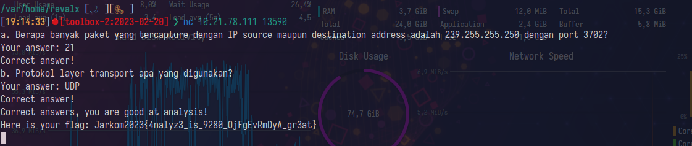

# Laporan Resmi Modul 1 Jarkom 2023

Anggota:
- [MH] Muhammad Hidayat (05111940000131)
- [VG] Victor Gustinova (5025211159)

## Soal 1 [MH]

Filter yang digunakan pertama adalah `ftp.request.command == "STOR"` untuk perintah upload dan ditemukan frame 147.

<!-- TODO change wikilink format -->


Diketahui nama filenya adalah `"c75-GrabThePhisher.zip"`, jadi dicari dengan filter
`ftp.response.arg contains "c75-GrabThePhisher"` dan ditemukan pada frame 149.


Dari sana dapat didapatkan flagnya.


## Soal 2 [VG]

![[WhatsApp Image 2023-09-18 at 21.59.15.jpeg]]

![[WhatsApp Image 2023-09-18 at 21.59.03.jpeg]]

![[WhatsApp Image 2023-09-18 at 21.59.36.jpeg]]
## Soal 3 [MH]

Awalnya kami mencari IP 239.255.255.250. Kami menemukan bahwa SSDP dan UDP memberikan informasi port, jadi kami coba filter berdasarkan itu. Kami temukan dari keduanya bahwa hanya UDP yang memiliki property `port`.  Ini yang mendasari jawaban kami untuk (b).

Kalimat display filter yang digunakan:

`ip.host == 239.255.255.250 && udp.port == 3702`

Untuk (a), banyak paket yang tampil dengan filter di atas terdapat 21. Ini didapat dari pojok kanan bawah tampilan Wireshark.




## Soal 4 [VG]

![[WhatsApp Image 2023-09-18 at 21.59.36.jpeg]]

## Soal 5 [MH]

a. Banyak packet yang ditangkap adalah 60.
   

b. Port SMTP adalah port 25.

c. Hanya ada satu public IP, yaitu 74.53.140.153

Ditemukan isi email yang bersi password pada frame 22:

```
Hello

I send u a p45sword of a zip file, but you should decode it in Base64.

Here is the p45sword:

NWltcGxlUGFzNXdvcmQ=
```


## Soal 6 [VG]

unsolved

## Soal 7 [MH]

Sangat mudah, filternya `ip.dst_host == 184.87.193.88`, ditemukan 6 packet.


## Soal 8 [VG]

Gunakan `dstport` untuk port keluar.

`tcp.dstport == 80 || udp.dstport == 80`

Yang melakukan submit adalah [MH]

![[Pasted image 20230918212111.png]]

![[WhatsApp Image 2023-09-18 at 22.00.18.jpeg]]

## Soal 9 [MH]

Tidak perlu melakukan filter pada file pcap. Hanya query-nya saja.

`ip.src == 10.51.40.1 && ip.dst != 10.39.55.34`


## Soal 10 [VG]

![[WhatsApp Image 2023-09-18 at 22.01.00.jpeg]]

![[WhatsApp Image 2023-09-18 at 22.01.08.jpeg]]![[WhatsApp Image 2023-09-18 at 22.01.31.jpeg]]![[WhatsApp Image 2023-09-18 at 22.01.37.jpeg]]![[WhatsApp Image 2023-09-18 at 22.01.45.jpeg]]![[WhatsApp Image 2023-09-18 at 22.01.53.jpeg]]![[WhatsApp Image 2023-09-18 at 22.01.58.jpeg]]![[WhatsApp Image 2023-09-18 at 22.02.07.jpeg]]![[WhatsApp Image 2023-09-18 at 22.02.14.jpeg]]

